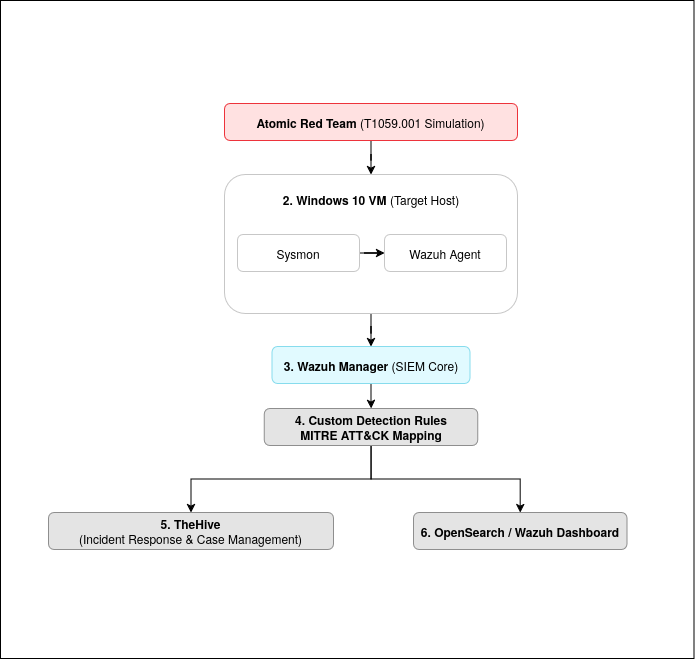
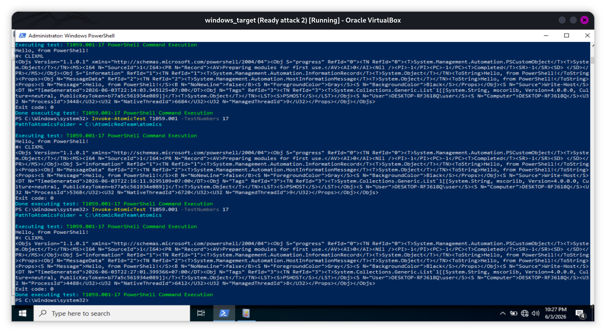
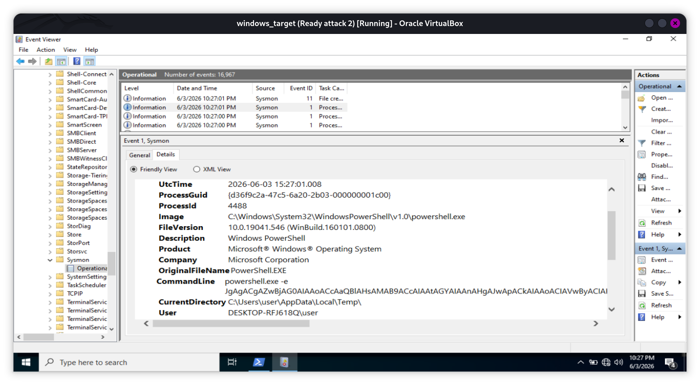
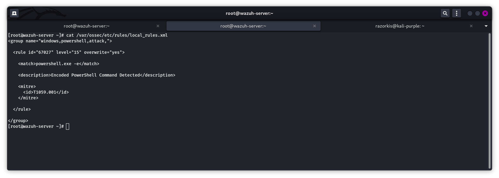
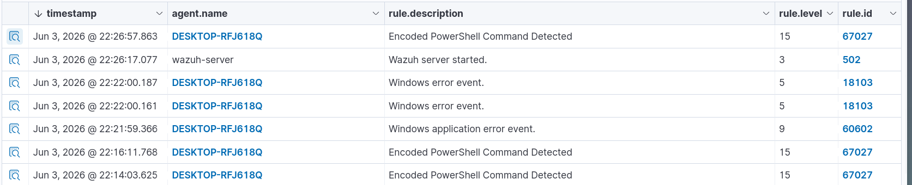
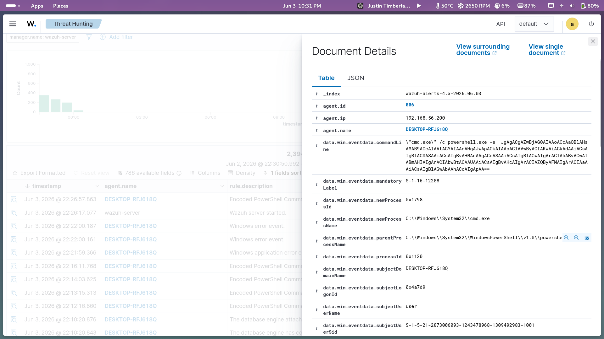
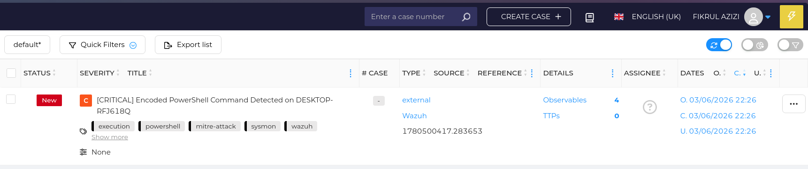
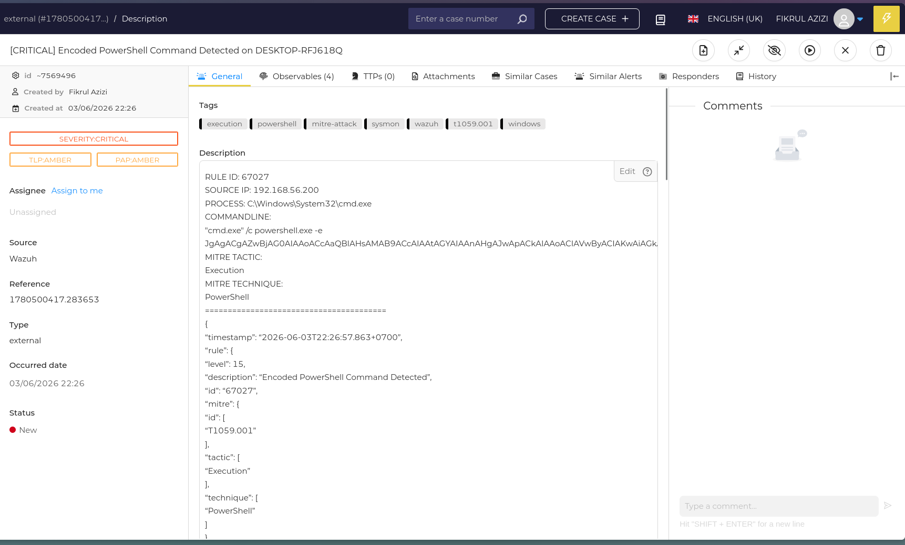

# SOC Detection Engineering Lab – PowerShell Encoded Command Detection


## Overview

This project demonstrates an end-to-end SOC workflow focused on detecting suspicious PowerShell activity using Sysmon, Wazuh, OpenSearch, and TheHive. The lab simulates a realistic attack scenario based on MITRE ATT&CK T1059.001 (PowerShell) using Atomic Red Team.

The objective of this project is to validate how endpoint telemetry can be collected, analyzed, correlated, and escalated into actionable security alerts for SOC operations and threat hunting activities.

---

# Lab Environment

| Component | Description |
|---|---|
| Windows 10 VM | Target endpoint |
| Sysmon | Endpoint telemetry collection |
| Wazuh Agent | Log forwarding |
| Wazuh Manager | SIEM & detection engine |
| OpenSearch Dashboard | Threat hunting & visualization |
| TheHive | Incident response platform |
| Atomic Red Team | Attack simulation framework |

---

# Architecture



---

# Attack Simulation

The attack simulation was performed using Atomic Red Team with the following MITRE ATT&CK technique:

- Technique ID: T1059.001
- Technique Name: PowerShell

The simulation generated encoded PowerShell execution activity designed to imitate suspicious command execution behavior commonly observed during post-exploitation stages.

Example execution:

```powershell
Invoke-AtomicTest T1059.001
```

The generated command executed PowerShell with encoded arguments such as:

```text
powershell.exe -e <base64_encoded_command>
```

This type of execution pattern is frequently abused by attackers to obfuscate malicious commands and bypass basic detection mechanisms.

## Screenshot



---

# Sysmon Telemetry Collection

Sysmon Event ID 1 (Process Creation) was used to capture process execution telemetry from the Windows endpoint.

The following telemetry fields were successfully collected:

- Process image
- Parent process
- Command-line arguments
- User context
- Process GUID
- Integrity level

Example observed process:

```text
powershell.exe -e <base64_encoded_command>
```

Sysmon provided detailed endpoint visibility that became the primary telemetry source for the detection workflow.

## Screenshot



---

# Wazuh Log Collection

The Wazuh agent forwarded Sysmon telemetry from the Windows endpoint to the Wazuh Manager for centralized analysis.

Collected logs were successfully parsed and normalized through the Windows Event Channel decoder.

Key telemetry observed inside Wazuh included:

- PowerShell execution
- Encoded command-line arguments
- Parent-child process relationships
- User execution context

---

# Custom Detection Engineering

A custom Wazuh rule was created to detect encoded PowerShell execution activity.

Detection logic:

```xml
<rule id="67027" level="15" overwrite="yes">
  <if_sid>61603</if_sid>

  <field name="win.eventdata.commandLine" type="pcre2">(?i)(powershell.*-e|powershell.*-enc)</field>

  <description>Encoded PowerShell Command Detected</description>

  <mitre>
    <id>T1059.001</id>
  </mitre>

  <group>
    powershell,
    attack.execution,
    sysmon
  </group>
</rule>
```

The rule searches for PowerShell executions containing encoded command arguments such as:

- `-e`
- `-enc`

These arguments are commonly associated with obfuscated PowerShell activity used during offensive operations and malware execution.

## Screenshot



---

# Threat Hunting Validation

The generated telemetry was successfully indexed into OpenSearch and became searchable through the Wazuh Dashboard.

Threat hunting validation activities included:

- Filtering high-severity alerts
- Reviewing PowerShell command-line activity
- Validating MITRE ATT&CK mappings
- Correlating Sysmon process execution telemetry

Generated alert details:

| Field | Value |
|---|---|
| Rule ID | 67027 |
| Severity | 15 |
| Description | Encoded PowerShell Command Detected |
| Technique | T1059.001 |
| Log Source | Sysmon Event ID 1 |

## Screenshot




---

# TheHive Integration

Detected alerts were automatically forwarded into TheHive using a custom Wazuh integration script.

The integration allowed SOC alerts to be escalated into incident response workflows for investigation and case management.

TheHive received the following information:

- Source IP address
- Endpoint hostname
- Process name
- Command-line activity
- MITRE ATT&CK mapping
- Alert severity

This integration demonstrates how endpoint telemetry can move through a complete SOC pipeline from detection to incident response handling.

## Screenshot




---

# Detection Workflow Summary

1. Atomic Red Team generated PowerShell attack simulation activity.
2. Sysmon captured endpoint process telemetry.
3. Wazuh Agent forwarded logs to the Wazuh Manager.
4. Custom Wazuh rules detected encoded PowerShell execution.
5. OpenSearch indexed alerts for threat hunting visibility.
6. TheHive received escalated alerts for incident response operations.

---

# Key Takeaways

- Sysmon provides detailed endpoint telemetry useful for detection engineering.
- Encoded PowerShell execution remains a strong detection opportunity for SOC environments.
- Wazuh custom rules can effectively detect suspicious PowerShell activity.
- OpenSearch enables centralized threat hunting and log analysis.
- TheHive helps operationalize security alerts into manageable investigation workflows.

---

# Conclusion

This lab successfully demonstrated how a suspicious PowerShell execution can be detected and investigated through an end-to-end SOC workflow.

Starting from attack simulation with Atomic Red Team, telemetry was collected by Sysmon, analyzed by Wazuh, validated through OpenSearch, and escalated into an incident case within TheHive.

Beyond the technical implementation, this project provided valuable hands-on experience in detection engineering, threat hunting, and incident response workflows. It also reinforced the importance of understanding telemetry, tuning detection logic, and providing context to security alerts.

The knowledge gained from this project serves as a foundation for developing more advanced detection scenarios and expanding SOC monitoring capabilities in future labs.

---

# References

- MITRE ATT&CK – T1059.001 PowerShell
- Atomic Red Team
- Sysmon
- Wazuh Documentation
- TheHive Project
- OpenSearch Documentation
